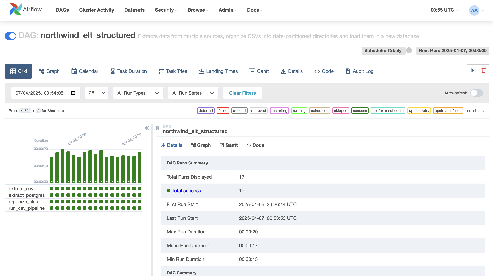
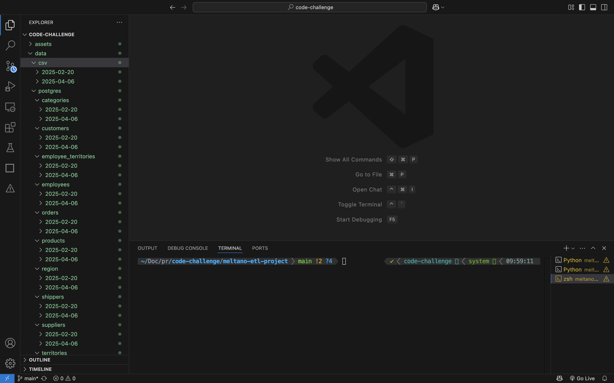

# Indicium Tech Code Challenge

Code challenge for Software Developer with focus in data projects.

## Technologies Used

- Python (Version **3.9.6**)
- Meltano (Version **3.6.0**)
- Docker (Version **27.3.1**)
- Docker Compose (Version **2.29.7**)
- PostgresSQL (Version **14.15.0**)

## Installation

1. Clone the repository

```bash
git clone https://github.com/douglasmnegri/code-challenge.git
cd code-challenge
```

2. Python Environment (Recommended)

```bash
python3 -m venv venv_name
source venv_name/bin/activate  # macOS/Linux
venv_name\Scripts\activate     # Windows (PowerShell)
```

3. Run requirements.txt to install dependencies

```bash
pip install -r requirements.txt
```

4. Meltano: Navigate to the project subdirectory and install meltano's dependencies

```bash
  cd meltano-etl-project
  meltano install
```

5. Airflow

```bash
meltano add utility airflow
meltano invoke airflow:initialize
meltano invoke airflow users create -u admin@localhost -p password --role Admin -e admin@localhost -f admin -l admin
```

6. Optional: Set Airflow Home Directory

By default, Meltano sets `AIRFLOW_HOME` internally to `.meltano/run/airflow`. 
You usually do **not** need to set this manually.

Only set this if you're troubleshooting (You can also change the configs inside the file airflow.cfg):

```bash
export AIRFLOW_HOME=$(pwd)/airflow
````

## Running the project

1. From the root directory (code-challenge) start the docker-compose.yml file that contains both databases:

```bash
docker-compose up --build
docker-compose up -d
```

2. From meltano's directory start the airflow on two different terminals:

```bash
meltano invoke airflow scheduler
meltano invoke airflow webserver --port 8080
```

3. You can now run DAGs from your terminal using Meltano:
   
```bash
   meltano invoke airflow dags trigger northwind_elt_structured
```


4. You can choose to run your DAG's from Airflow UI

- Open your browser and go to: 🔗 http://localhost:8080


## Airflow Running


## Tasks for past dates

